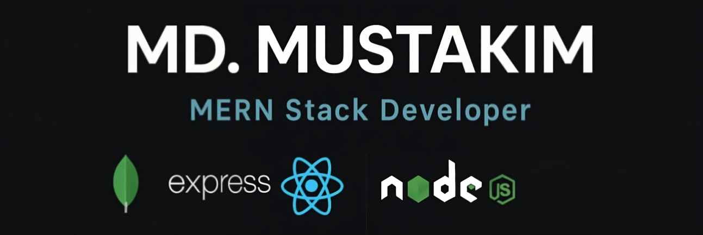

<!-- Banner Image -->

<h1 align="center">Hi, I'm Md. Mustakim 👋</h1>
<h3 align="center">MERN-Stack Web Developer | Learner | Explorer</h3>

---

## 🧑‍💻 About Me

I’m **Md. Mustakim**, a student and passionate web developer from Bangladesh. I love turning ideas into real-world web applications using modern technologies.

- 🔭 Currently working on: A full-stack authentication system with Firebase & MongoDB.
- 🌱 Exploring: Next.js and performance optimization techniques.
- 🎯 Goal: To become a proficient MERN Stack Developer.
- 🧠 Actively learning: Competitive programming and 8086 microprocessor assembly.
- 💬 Ask me about: React, JavaScript, or TailwindCSS.

---

## 🚀 Skills & Tools

  
  
  
  
  
  
  
  
  
  
  

---

## 🌐 Connect with Me

---

## 📊 GitHub Stats

  
  
  

---

⚡ **Fun fact**: I love debugging more than writing new code!

